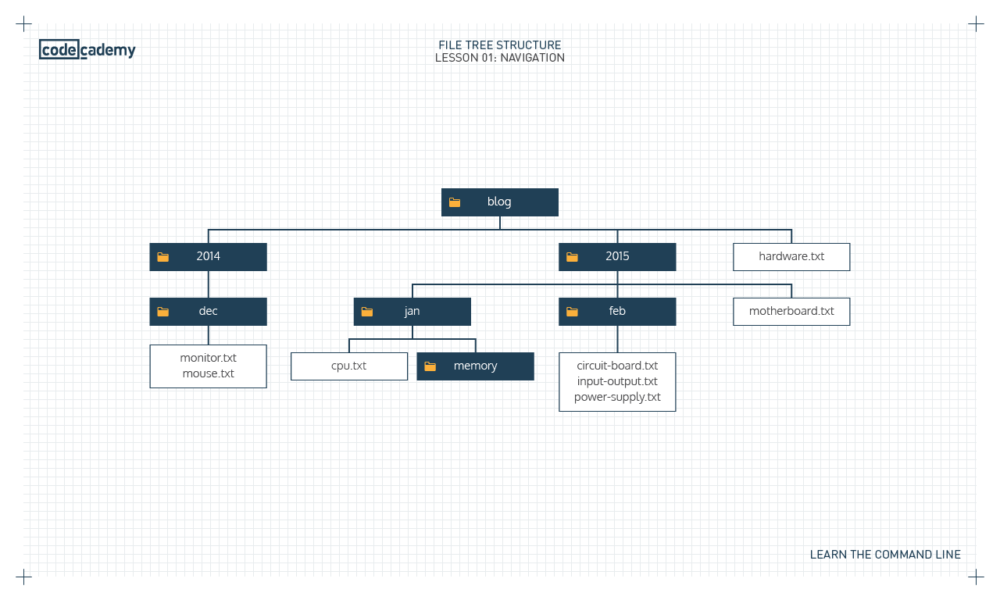

## Navigating the file system
Trong Unix, Command Line Interface (CLI) được gọi là Bash và shell prompt (dấu nhắc lệnh là `$`, nó xuất hiện thể hiện terminal sẵn sàng nhận lệnh). Trong Window sẽ tải Git bash về để dùng cho quen. Mac OS dùng Z shell cũng tương tự.

Thấy hay dùng **sundirectory/** để thể hiện thư mục (mình hay bỏ dấu /).

In ra path của thư mục đang làm việc (print working directory).
```python
pwd
```

Di chuyển đến các thư mục khác, `..` kí hiệu thư mục cha, `.` kí hiệu thư mục hiện tại.
```python
cd direc
cd ..
```

Tạo một thư mục mới (make directory)
```python
mkdir direc
```

Tạo một file mới
```python
touch new.txt
```

Có thể sử dụng `Tab` để tự động hoàn thành lệnh, sử dụng mũi tên lên xuống để di chuyển giữa các commands trước đó.

manipulation: thao tác

**Filesystem**
A filesystem organizes a computer’s files and directories into a tree structure:
- The first directory in the filesystem is the *root directory*. It is the parent of all other directories and files in the filesystem.
- Each parent directory can contain more child directories and files. In the filesystem on the right, blog/ is the parent of 2014/, 2015/, and hardware.txt.
- Each directory can contain more files and child directories. The parent-child relationship continues as long as directories and files are nested.



A command is a directive to the computer to perform a specific task. Lệnh là chỉ thị đến máy tính để thực hiện nhiệm vụ.


## Viewing and Changing the File System
**mv Move**
```python
mv index.html website/
```
`mv` giúp di chuyển file đến directory. File làm argument đầu tiên, destination directory làm argument thứ hai. Move sẽ di chyển file, điều này đồng nghĩa với việc file không còn trong thư mục cũ.

Có thể di chuyển cùng lúc nhiều files:
```python
mv my_file_1.txt my_file_2.txt my_directory/
```
Để đổi tên file có thể sử dụng `mv` như sau:
```python
mv file_origin.txt file_renamed.txt
```

**rm Remove**
```python
rm file_name
```

```python
rm -r directory
```
Muốn xóa directory và files trong đó phải dùng thêm option `-r`.

Nếu chỉ xóa tất cả các files trong directory mà không xóa directory
```python
rm directory/*
```
**ls List**
```python
ls -a
ls -l
ls -t
```
`ls` dùng liệt kê các nội dung trong directory.
- `-a`: liệt kê tất cả nội dung bao gồm cả file ẩn, directories, cả những cái bắt đầu với `.`
- `-l`: liệt kê ở dạng dài
- `t`: liệt kê nội dung theo thời gian sửa đổi.

Có thể kết hợp tất cả
```python
ls -alt
```

```python
drwxr-xr-x 5  cc  eng  4096 Jun 24 16:51  action
drwxr-xr-x 4  cc  eng  4096 Jun 24 16:51  comedy
drwxr-xr-x 6  cc  eng  4096 Jun 24 16:51  drama
-rw-r--r-- 1  cc  eng     0 Jun 24 16:51  genres.txt
```

The `-l` option lists files and directories as a table. **Here there are four rows, with seven columns separated by spaces**. Here’s what each column means:
- Access rights (quyền truy cập). These indicate the read, write, and execute permissions on the file or directory allowed to the owner, the group, and all users. You can read more about file permissions.
- Number of hard links. This number counts the number of child directories and files. This number includes the parent directory link (..) and current directory link (.).
- Tên user sở hữu file `cc`
- Tên của nhóm sở hữu `eng`
- Kích thước inbytes
- Ngày và thời gian lần cuối được sửa đổi
- Tên file hoặc dirctory

**cp Coypy**

copy vẫn giữ nguyên file trong thư mục cũ. Có thể copy nhiều file vào thư mục:
```python
cp file_1 file_2 destination
```
Change directory
```python
cd directory
```
```python
cd path_to_the_directory
```
Có thể copy cả thư mục. 

**Wildcards - Kí tự đại diện**
Thay vì sử dụng chính xác tên file chúng ta có thể sử dụng kí tự đặc biệt như * để chọn một nhóm files (gọi là wildcards - kí tự đại diện). Ví dụ có thể copy tất cả các file trong thư mục hiện tại vào thư mục khác:
```python
cp * my_directory/
```

```python
cp w*.txt my_directory/
```
Copy tất cả các files bắt đăù bằng `w` và kết thúc bằng `.txt` đến thư mục khác.

**cat**
Hiển thị nội dung file trên command line. we copy the contents of a source file into a destination file (copy nội dung từ source file vào destination file)
```python
cp source.txt destination.txt 
```
hoặc copy cả file vào destination directory
```python
cp file destination
```

# Redirecting input and output

What happens when you type this command?
```python
$ echo "Hello"
Hello
```
The echo command accepts the string “Hello” as standard input, and echoes the string “Hello” back to the terminal as standard output. echo nhận vào string làm standard input và trả về string như standard output.

Let’s learn more about standard input, standard output, and standard error:
- **Standard input**, abbreviated as `stdin`, is information inputted into the terminal through the keyboard or input device (thông tin nhận từ bàn phím, thiết bị đầu vào)
- **Standard output**, abbreviated as stdout, is the information outputted after a process is run (thông tin được đưa ra sau quá trình xử lý)
- **Standard error**, abbreviated as stderr, is an error message outputted by a failed process (lời nhắn lỗi được đưa ra bởi quá trình thất bại)

Redirection reroutes standard input, standard output, and standard error to or from a different location.

**Command line redirection**

Redirection là quá trình sử dụng input/output của file hoặc câu lệnh để làm input cho file khác. Redirection có thể sử dụng `>` để ghi đè, `>>` để chèn vào cuối.
Ví dụ
```python
ls > directories.txt
```
Lệnh ls sẽ liệt kê tất cả cá files và thư mục trong current directory, sau đó nó sẽ ghi tên các files, thư mục đó vào directories. Ngoài ra có thể sử dụng câu lệnh sau để chèn vào file.
```python
ls >> directories.txt
```

**Tìm kiếm theo pattern**

```python
grep 'anh' file.txt
```
Tìm kiếm các dòng có chứa 'anh' trong `file.txt`.


```python
grep -R pattern directory
```
Câu lệnh này dùng để tìm kiếm các file trong directory theo mẫu (pattern) bao gồm cả trong subdirectory và đưa ra các tên file và dòng trong files đó chứa kết quả khớp.

Ví dụ
```python
grep -R red ./
```
Nó sẽ tìm tất cả các từ chứa `red` trong các files trong thư mục hiện tại `./` kể các trong các thư mục con.

**Case insensitive search - tìm kiếm không phân biệt hoa thường**

```python
grep -i pattern filename
```
Chúng ta có thể search file theo pattern. Nó tìm kiếm lines trong files khớp với mẫu, không phân việt hoa thường và trả về kết quả.


**cat Display**
```python
cat file1.txt
cat file1.txt file2.txt
```

Lệnh `cat` giúp hiển thị nội dung một hoặc nhiều file trên terminal.

**Redirecting output - chuyển hướng (chuyển đến) đầu ra**

```python
echo "Hello" > hello.txt
```
Kí hiệu `>` dùng để chuyển hướng output bằng cách lấy output ở bên trái và truyền vào như input đến file bên phải.

>Chú ý: nội dung file cũ bị xóa đi (ghi đè - overwrite), thay vào đó là "Hello"

**Append redirect shell command**

```python
echo "Hello" >> xinchao.txt
```
Nếu dùng kí hiệu `>>` nó sẽ chuyển output của command bên trái rồi chèn vào cuối file bên phải. Như vậy "Hello" sẽ được chèn vào cuối file. Chính xác là chèn vào dòng mới. Thêm dữ liệu mà không xóa cái cũ.

```python
cat deserts.txt >> forests.txt
```
**<**
```python
$ cat < deserts.txt
```
`<` takes the standard input from the file on the right and inputs it into the program on the left. Here, `deserts.txt` is the standard input for the `cat` command. The standard output appears in the terminal.

`<` laays standard input từ file bên phải và đưa vào chương trình bên trái. Ở đây file `deserts.txt` được làm input cho câu lệnh `cat`.

**| Pipe (ống) shell command**
```python
# First, echo ""HelloWorld" will send Hello World to the standard output.
# Next, pipe | will transfer the standard output to the next command's standard input
# Finally, wc -c will count the number of words from ít standard input, which is 2
echo "Hello World" | wc -c
```
Kí hiệu `|` được gọi là *pipe*. Nó được sử dụng để lấy standard output của câu lệnh phía bên trái thành standard input của câu lệnh phía bên phải.

```python
$ cat volcanoes.txt | wc 
```
Output của `cat volcanoes.txt` thành input cho `wc`. `wc` trả về **số dòng, số từ, số kí tự** trong `volcanoes.txt`.

```python
$ cat volcanoes.txt | wc | cat > islands.txt 
```
Nhiều `|` có thể được nối với nhau. Standard output của `cat volcanoes.txt` được truyền tới (pipe to) `wc` command. Standard output của `wc` lại được truyền tới `cat`. Cuối cùng standard output của cat được truyền tới `islands.txt` (chèn vào file mới).
**>**
```python
$ cat deserts.txt > forests.txt
```
`>` takes the standard output of the command on the left, and redirects it to the file on the right. Here the standard output of cat deserts.txt is redirected to forests.txt. Nội dung của file bên tráu được ghi đè vào file bên phải.

## Configuring the environment
Environment variables là các variable có thể đươc sử dụng trên tất cả terminal command (dùng chung cho hệ điều hành và ứng dụng).

Dấu `~` trong là viết tắt cho `$HOME` (đường dẫn của home directory). Nên lệnh `cd $HOME` và `cd ~` hoàn toàn giống nhau. Nếu dùng mỗi `cd` nó cũng đưa về thư mục home.

```python
history
```
Nó giúp hiển thị tất cả các câu lệnh đã được thực thi trong phiên hiện tại (current session).

Biến môi trường `$HOME`.
```python
echo $HOME
```
Câu lệnh này trả về đường dẫn của *home directory*.

```python
env
```
Câu lệnh này trả về tất cả environment variables cho current session.

```python
alias pd="pwd"
```
Cho phép gán câu lệnh thành dạng rút gọn hơn (gọi là alias - tham chiếu).


