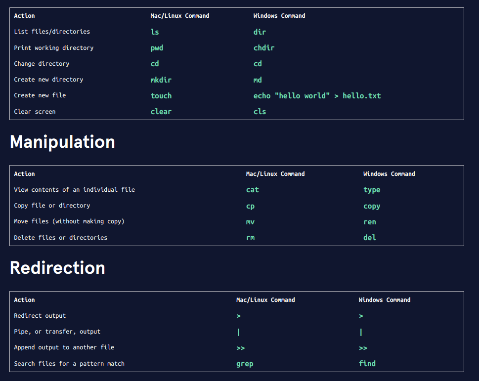
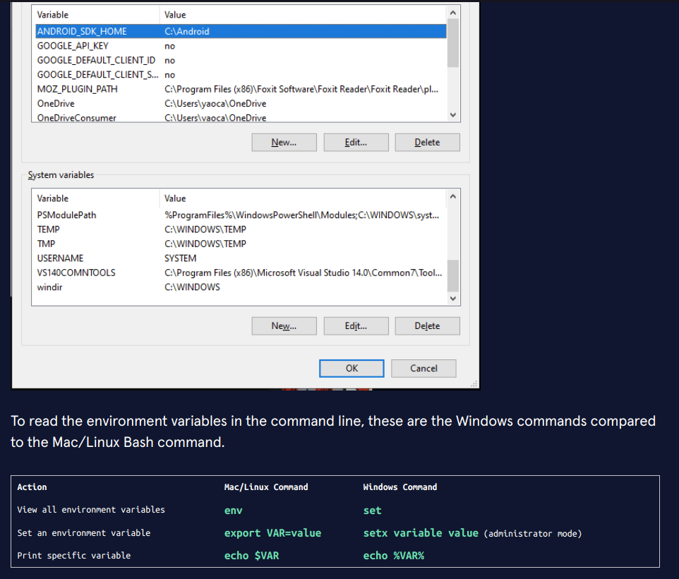

Introduction to Command Line
A brief overview of the Learn the Command Line course.

What is the Command Line?
The command line is a text interface for the computer’s operating system. You can use it to traverse and edit your computer’s filesystem. Through the command line, you can create new files, edit the contents of those files, delete files, and more!

On Mac and Linux systems, we access the command line through something called Bash. In this course, we will focus on Bash. Although Windows comes with a different built-in command line, Windows users can also download Bash. We’ll go into what that means and how to set it up on your personal device later in the course, but feel free to look ahead now.

What will you learn?
This course will take you through the various functionalities of how to use the command line, starting with navigation, and ending with configuring the environment. At any point, you can access the cheatsheet of commands for this course here.

Navigation
In this module, you will learn how to navigate through a computer’s filesystem solely through the command line. You’ll learn how to view the contents of your filesystem, move through the different directories (folders), and make new files and directories.

Manipulation
In this module, you will learn how to manipulate the contents of the filesystem with the command line. You’ll learn how to move files, delete files and directories, and more.

Redirection
In this module, you will learn how to redirect standard input, standard output, and standard error messages. You’ll learn how to display the contents of a file, write to that file, search through directories, and more.

Configuration
In this module, you will learn how to configure your local environment. You’ll learn how to set and edit your settings and preferences, assign aliases (shortcuts), how to use nano, and more.

In this final module, we will also sum up how the command line works for Windows users.

Let’s get started!

Cài đặt Bash https://www.codecademy.com/courses/learn-the-command-line/articles/command-line-setup

## Window Command Line
Windows Command Line
This article is for the Windows user! We will offer more detail about how to apply the knowledge from the Command Line course in the Windows environment.

How do Windows users access the command line?
We will discuss a few options for accessing the command line in Windows. We’ll introduce Windows Command Prompt, which is the system default for basic tasks, and Powershell, which is a more advanced tool often used by system administrators. We will also touch on Git Bash, which will allow you to use all the commands we teach in this course on your Windows system.

At the end of the article, we will also provide Windows Command Prompt equivalents of the Bash commands from this course.

Windows Command Prompt
The image shows a Windows Command Prompt window where the user has entered a command `dir Lemonade`, which displays the contents of the folder called Lemonade.
Windows Command Prompt comes preloaded into Windows systems. This tool allows for basic system-related tasks. For example, you can run the following command to shut down the computer in two hours:

shutdown -s -t 7200
This command prompt is quite limited in its functionality especially when used for software development, but has been kept to maintain backwards compatibility. You can access this tool by bringing up the Start menu and typing cmd. We’ll share some equivalent commands to Mac/Linux Bash at the end of the article!

Powershell
Powershell is an important tool for system administrators in Windows environments. It was introduced in 2006 to allow users to write much more powerful scripts, and to redirect outputs of commands like one can in Bash.

PowerShell has its own syntax where commands are literal verbs of what’s happening. For example, the following command changes the current directory to C:\Desktop.

Set-Location "C:\Desktop"
Windows Terminal
As of summer 2020, Windows has released Windows Terminal, an interface that combines Command Prompt, Powershell, and, if it detects that you have Windows Subsystem for Linux installed, Linux Bash!

Git Bash
Git Bash lets you use Bash commands on your Windows computer. It is our most recommended Windows command line setup for users that need the command line primarily for software development. Many software tools include Bash commands to install, configure, and run them.

Below is a tutorial for setting Git Bash up on Windows:

https://cmdref.net/os/windows/command/index.html#windows_commands_cheat_sheet

https://docs.microsoft.com/en-us/windows-server/administration/windows-commands/windows-commands

## Configuring the Command Line Environment
The command line is an indispensable tool for developing projects. You can use the command line to manage all your project files; you can move files, delete files, reorganize them, search and replace terms in your project, and so much more. You can also control the execution of programs you write and run commands from development software. The terminal becomes a busy place! This is why the command line is an environment in and of itself.

A computer screen with one side being a code editor with JavaScript code, and the other side being a terminal with a black background and green letters, showing text output and a long key code.
Photo by Arget on Unsplash

Within the command line environment, you can have many things running at once! For example, you can execute a Python project and keep track of output as a program runs (and redirect that output to a file), you can edit files directly inside the command line, and you can run commands from development software like Git to keep things organized. As you become a more seasoned developer, you will find it necessary to configure the command line environment to your liking and convenience.

In this lesson, you will add special settings to customize the command line environment. Specifically, you will learn:
- how to use `nano`, a keyboard-only text editor that exists in the command line
- what the `bash profile` is
- how to store shorthands (called alias) for commonly used commands
- how to change the way your command prompt looks
- how to establish and access global command-line variables
- what the `PATH` variable is and how to check which directories executable commands come from

